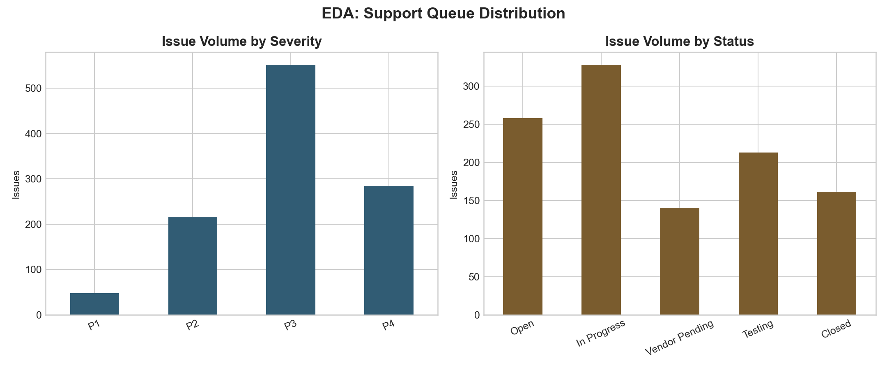
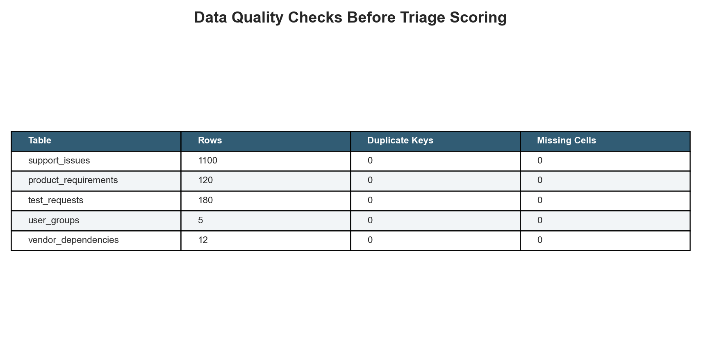
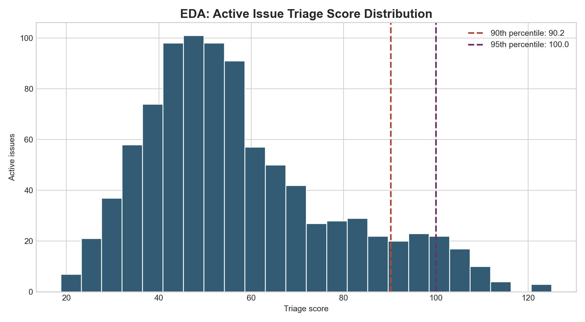
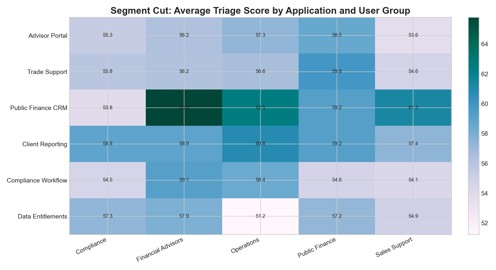
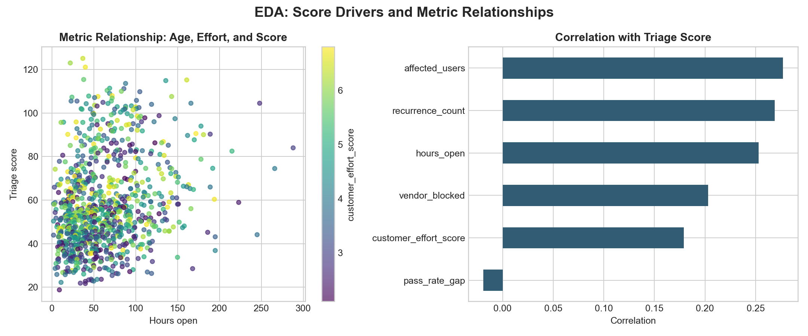
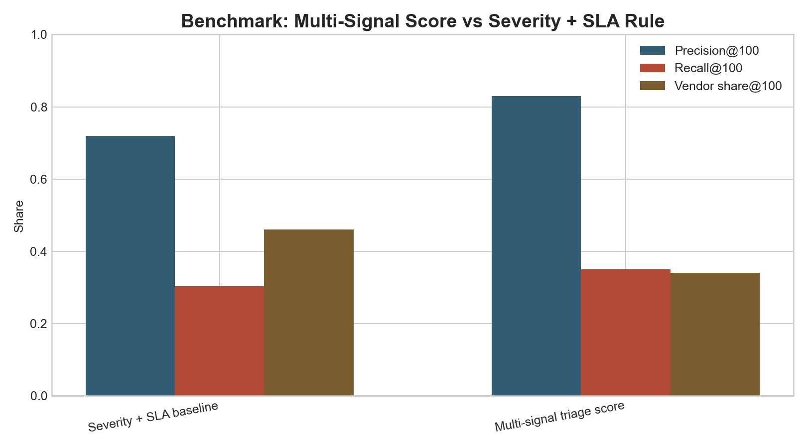

# Financial Product Support Triage Workbench

## Motivation

Financial product support teams need a defensible way to decide which application issues deserve attention first when Service Center tickets, user-group feedback, vendor dependencies, release testing, and product requirements all compete for the same analyst capacity. The hard part is not building another dashboard; it is making the prioritization logic inspectable enough that operations, technology, vendors, and product owners can challenge it in a review meeting.

Repository: https://github.com/Saurav-Kanegaonkar/FinancialProductSupportTriageWorkbench

## What This Project Is

This is a non-web analysis workbench for a Product Analyst supporting financial applications. It creates deterministic source-style data, runs EDA and quality checks, scores active issues, compares the multi-signal score against a simpler severity/SLA rule, and writes stakeholder-ready outputs for release readiness and issue escalation.

## Why This Problem Matters

A P2 issue that is stale, recurring, vendor-blocked, and tied to release testing can be more urgent than a fresh P1 with a clear owner. Without a repeatable triage process, teams can overreact to severity labels, miss user-impact clusters, report misleading release readiness, or send user groups vague status updates.

## Data And Evidence Used

- `data/support_issues.csv`: 1,100 Service Center-style application issues across six financial product surfaces.
- `data/product_requirements.csv`: 120 requirement records shaped from recurring support themes.
- `data/test_requests.csv`: 180 UAT, regression, vendor validation, and data validation records.
- `data/user_groups.csv`: 5 stakeholder groups and communication/update patterns.
- `data/vendor_dependencies.csv`: 12 vendor dependency records for turnaround and risk context.
- `analysis/outputs/`: 10 generated analytical outputs covering KPIs, quality checks, EDA segments, outliers, release readiness, benchmark results, and sensitivity scenarios.

The data is synthetic because real securities support queues are not public. It is generated deterministically with a fixed seed so every chart and output can be reproduced.

## How The Project Works

1. Generate source-style support operations data with `scripts/generate_data.py`.
2. Run data quality checks for row counts, duplicate primary keys, and missing cells.
3. Score each issue using illustrative review weights for severity, SLA breach pressure, recurrence, affected users, customer effort, and vendor blocker status.
4. Preserve the full ranked queue while filtering `top_25_upgrade_blockers.csv` to active statuses only.
5. Add EDA cuts by severity, status, application, user group, outlier profile, and metric relationships.
6. Compare the multi-signal score with a simpler severity/SLA baseline using precision and recall against a synthetic same-week review flag.
7. Render evidence images into `docs/images/` so the work can be inspected without running code.

## EDA And Data Quality

### Support Queue Distribution



The queue is intentionally not P1-heavy: most records are P3/P4, which makes prioritization realistic because analysts must distinguish routine backlog from escalation-worthy items. Active statuses total 939 issues after excluding recently closed items from the blocker queue.

### Data Quality Checks



Each source table has zero duplicate primary keys and zero missing cells in the generated dataset. That matters because the triage model assumes one row per issue, requirement, test request, user group, and vendor dependency.

### Active Score Distribution And Outliers



The median active score is 53.0, the 90th percentile is 90.2, and the 95th percentile is 100.0. The outlier export `analysis/outputs/triage_score_outliers.csv` identifies the issues where severity, SLA aging, recurrence, user impact, and vendor blockers stack together.

### Segment Risk Heatmap



Public Finance CRM has the highest average active triage score at 60.6, followed by Client Reporting at 59.1 and Trade Support at 56.8. The segment cut makes the user-group conversation more precise: Financial Advisors in Public Finance CRM stand out as the highest-risk segment.

### Metric Relationships



The score is most strongly associated with SLA breach pressure, followed by affected users, recurrence, hours open, vendor blockers, and customer effort. Release pass-rate gap is intentionally analyzed separately because release health should inform escalation context without overwhelming issue-level support severity.

## Outputs And Recommendation Evidence

### Triage Score By Application


This chart shows which supported applications concentrate the highest combined severity, SLA, recurrence, user-effort, and vendor-blocker risk.

### Release Readiness Risk Matrix


This matrix compares pass-rate gap, open defects, and not-ready tests across releases. Darker color means higher release-readiness risk, avoiding the misleading pattern where high pass rate looks like high risk.

### Top Upgrade Blockers


This active-only ranked table gives a meeting-ready view of the highest-priority issues to review before user group updates and release planning. Closed issues remain in the full ranked audit file, but they are excluded from the blocker queue.

## Model-Vs-Rule Benchmark



This role does not need a black-box predictive model because the analyst must explain prioritization choices to stakeholders. Instead, the workbench benchmarks the transparent multi-signal score against a simpler severity/SLA rule. Against a synthetic same-week review flag, the multi-signal score captures 83 review-required items in the top 100, compared with 72 for the baseline.

The benchmark supports using the multi-signal score as a review queue, not as an automated decision. The baseline is easier to explain but over-indexes on SLA breach and vendor-blocked items; the multi-signal score better balances customer effort, recurrence, affected users, and release context.

## Scoring Logic

The triage score is an illustrative review score, not an automated business rule. It uses P1-P4 severity as the baseline urgency, then adds capped points for SLA age versus target resolution window, recurrence, affected users, customer effort, and vendor-blocked status. The caps prevent any one proxy from dominating the queue.

The sensitivity output `analysis/outputs/sensitivity_scenarios.csv` tests SLA-heavy, user-impact-heavy, and vendor-escalation-heavy weighting. Top-25 overlap ranges from 16 to 22 issues versus the current review weights, which shows the operating queue is sensitive to stakeholder priorities and should be calibrated with real historical support outcomes.

## What The Analysis Says

- Public Finance CRM is the highest-pressure application by average active triage score, especially for Financial Advisors.
- The top active blockers combine SLA breach, high severity, recurrence, affected users, and vendor dependency rather than severity alone.
- Release readiness risk is concentrated where pass-rate gap, open defects, and not-ready tests align; REL-05 and REL-04 deserve the first review.
- A transparent multi-signal score beats a severity/SLA baseline on review-required capture while remaining easy enough to defend in a stakeholder meeting.
- Data quality checks pass cleanly, so the analytical risk is not missing/duplicate synthetic records; the main risk is whether the illustrative weights match real support history.

## Recommendations

1. Review the active top 25 blockers before the next release readiness meeting, starting with Public Finance CRM issues owned by Financial Advisors and Operations.
2. Convert recurring high-score issue clusters into product requirements with acceptance criteria and planned increments.
3. Escalate high-risk vendor dependencies before release signoff rather than after user-group frustration surfaces.
4. Use the sensitivity scenarios as a calibration conversation: choose SLA-heavy, user-impact-heavy, or vendor-heavy weights based on leadership's operating priority.
5. Track SLA breach rate, average hours open, vendor-blocked share, review-required capture, and customer effort as Power BI-ready product support KPIs.

## Repository Structure

```text
.
├── analysis/
│   ├── analysis_plan.md
│   ├── executive_findings.md
│   ├── outputs/
│   └── sql_checks.sql
├── data/
├── docs/images/
├── scripts/generate_data.py
├── src/triage_model.py
├── data_dictionary.md
├── project_discovery_brief.md
├── README.md
└── STATUS.md
```

## How To Run Or Inspect

```bash
python3 -m pip install -r requirements.txt
python3 scripts/generate_data.py
```

The script writes source tables, ranked outputs, benchmark outputs, EDA summaries, KPI summaries, and rendered evidence images using a fixed random seed.

## Caveats And Limitations

- The data is synthetic and designed to represent a realistic support operations workflow, not a real broker-dealer system.
- SLA thresholds, effort scores, review-required labels, and triage weights are illustrative and should be calibrated against real support history before production use.
- The workbench does not include Salesforce, Power BI, or SharePoint integrations; it produces source-style tables and outputs that could feed those tools.
- The analysis intentionally stays in a reproducible workbench format rather than a dashboard because the JD's strongest proof burden is prioritization logic, issue research, testing support, and stakeholder-ready recommendations.
